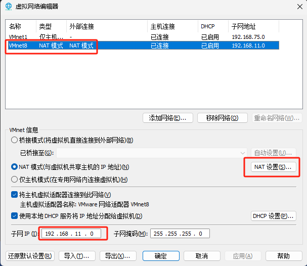
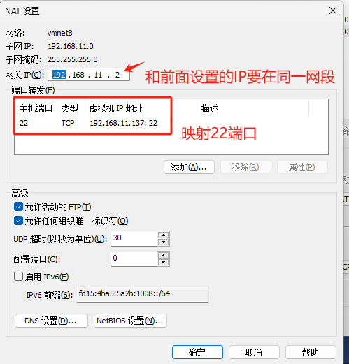

## 装机
#### linux
下载镜像文件，制作装机盘
推荐系统：  
1. [RedHat系列 Rocky 8](https://rockylinux.org/download/)  
   [龙蜥：Anolis 8](https://mirrors.openanolis.cn/anolis/8.8/isos/GA/x86_64/)
2. 磁盘分配策略：回收所有磁盘， /home 目录10-100G,其他全挂载在根目录 /
3. 选择时区，亚洲/上海
4. 可以设置固定ip
5. 重启前把u盘扯了

#### windows
[ITSKY/ 优启通/万能驱动](https://www.itsk.com/)


## 配置虚拟机与主机通信
### 配置虚拟机与主机通信





#### 修改完成之后要重启
```shell
#虚拟机内执行,
reboot
```