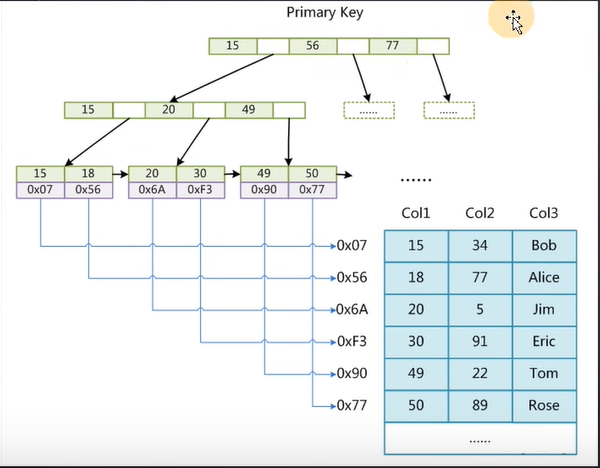
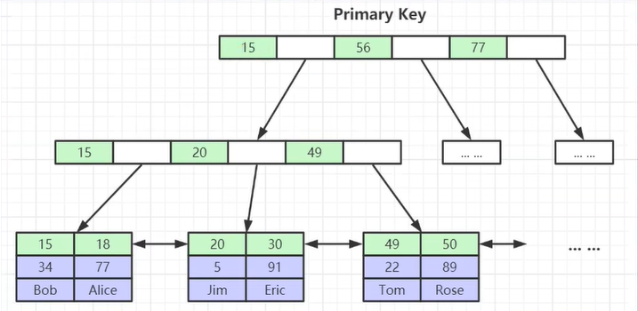
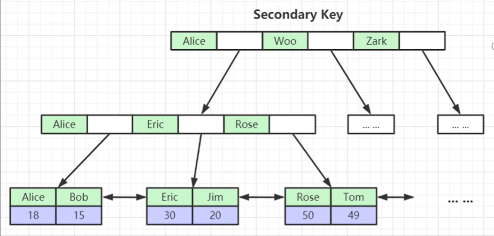

# 索引

## 什么是索引

```text
个人感觉索引就是用一种数据结构来组织数据，并排序，方便查找。
```

## 为什么要索引
```text
为了提高数据的查找的效率。因为数据库不只是存储数据，查找的比重占更多。
在数据库中，数据的量往往非常大，如果没有索引，每次查询都需要遍历整个数据集，导致查询速度变慢。而通过使用索引，可以根据索引的数据结构快速定位到所需数据，大大减少查询的时间复杂度。
TODO 对比有无索引的情况，可以使用数据库查询优化工具（如EXPLAIN语句）来查看查询的执行计划和性能差异。

在没有索引的情况下，查询操作通常需要全表扫描，即遍历整个数据表来查找匹配的数据。而在有索引的情况下，数据库可以利用索引的结构，快速定位到所需数据的位置，避免全表扫描，提高查询效率。
```

## 索引分类
1. 主键索引
2. 唯一索引
3. 普通索引
4. 全文索引
...

### 主键索引
```text
主键索引是对表的主键字段建立的索引。主键是用来唯一标识表中每一行数据的字段，它可以保证数据的唯一性和索引的快速查找。
```

### 唯一索引
```text
唯一索引是对表中的某个字段或多个字段建立的索引，用于确保该字段或字段组合的值的唯一性。
跟主键索引不同的是，唯一索引允许有空值（NULL），但字段值不能重复。
```

### 普通索引
```text
普通索引是对表中的某个字段或多个字段建立的索引，用于提高查询效率。普通索引可以包含重复的值，并且允许字段值为NULL。
```

### 全文索引
```text
这个东西用的比较少，可以配合 mysql 的 ngram分词分词工具来使用。不过一般都用ES吧
```

## 数据库的索引方式
1. B-tree 其实是B+树
2. Hash   没用过，不讲

# B+树
官方文档介绍：https://dev.mysql.com/doc/refman/8.0/en/glossary.html#glos_b_tree

## 为什么要用B+树

### 数据结构可视化工具
https://www.cs.usfca.edu/~galles/visualization/BTree.html

### 为什么会选择B+树作为组织数据的数据结构呢
B+树的特点
1. 有序
2. 一个节点先可以有多个子节点
3. 子节点冗余了父节点
4. 一个节点有多个元素
5. 子节点中都有双向指针

### 对比二叉树，二叉平衡树，以及B树，B+树 
二叉树，主键递增的话，会变成链表。
二叉平衡树会根据大小排序。但是层级很高。

### 为什么不能建太多索引
因为索引的存储需要空间，增删改某个表的时候，也需要更新这个表的索引
会把索引load进内存进行查找

# 数据的组织方式

## MYISAM
MyISAM是MySQL的一种表存储引擎，它使用非聚簇索引。数据和索引分别存储在不同的文件中（.MYD和.MYI文件），索引文件中存储了数据在磁盘上的地址。
在使用索引进行查询时，首先在索引文件中定位到数据的地址，然后在数据文件中读取相应的数据。
如果sql查询走索引的话，先在 .MYI 中定位到要查找数据的地址，并在 .MYD中查找


## InnoDB
聚簇索引
.frm 文件：.frm 文件是表的定义文件，它存储了表的结构和元数据信息，包括列名、数据类型、约束等。该文件对于表的操作和管理非常重要。
.ibd 文件：.ibd 文件是InnoDB表空间文件，它存储了表的数据和索引。每个InnoDB表都有一个独立的 .ibd 文件。它包含了表中的行数据和相关的索引数据。
数据和索引放在一起的 .idb
主键索引 img_2

非主键索引 img_3 非主键索引下面存的是主键

