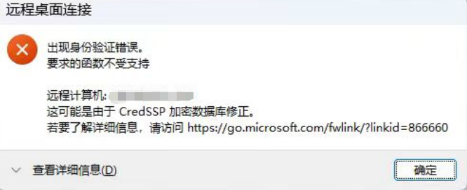
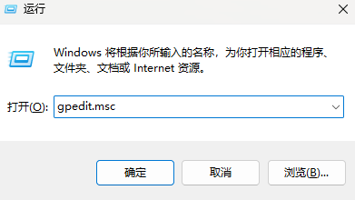
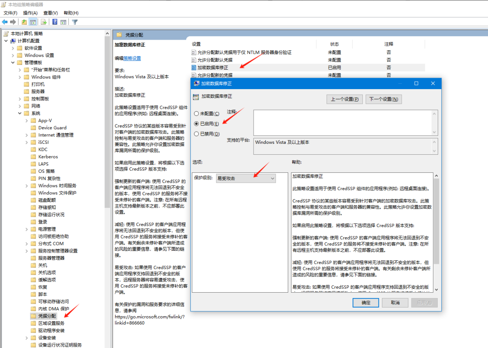

## window激活

### 不能连接到组织/cont connect to group
```shell
slmgr /ipk W269N-WFGWX-YVC9B-4J6C9-T83GX
slmgr /skms kms.03k.org
slmgr /ato
```

## 输入法英文状态下，输入字母带空格
```shell
shift + space
```

## 修改文件的所属权限
```shell
takeown /f \path\to\dir /r /d y
```

## 删除 $WINDOWS.~BT
step1:
```shell
takeown /F C:\$Windows.~BT\* /R /A
```
step2:
```shell
icacls C:\$Windows.~BT\*.* /T /grant administrators:F
```
step3:
```shell
rmdir /S /Q C:\$Windows.~BT\
```

## 商业版
```text

1. https://next.itellyou.cn/Identity/Account/Login?ReturnUrl=%2FOriginal%2FIndex
2. window10 business editions
4. 数字权利激活
```

## 远程问题
问题：

解决办法：  

