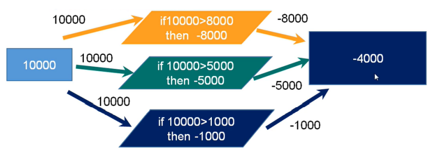
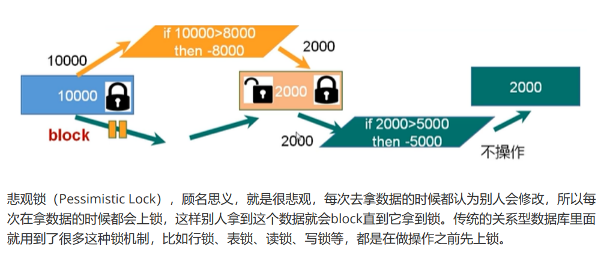
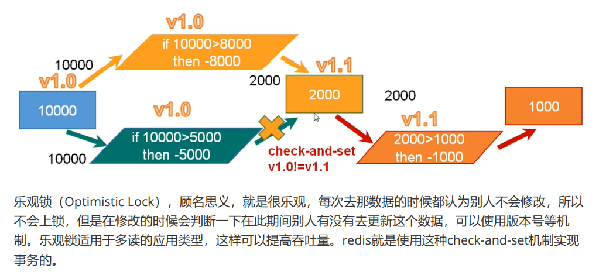
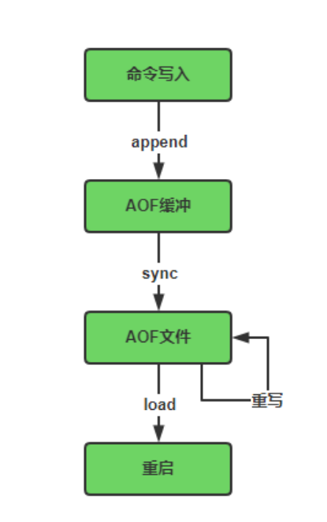
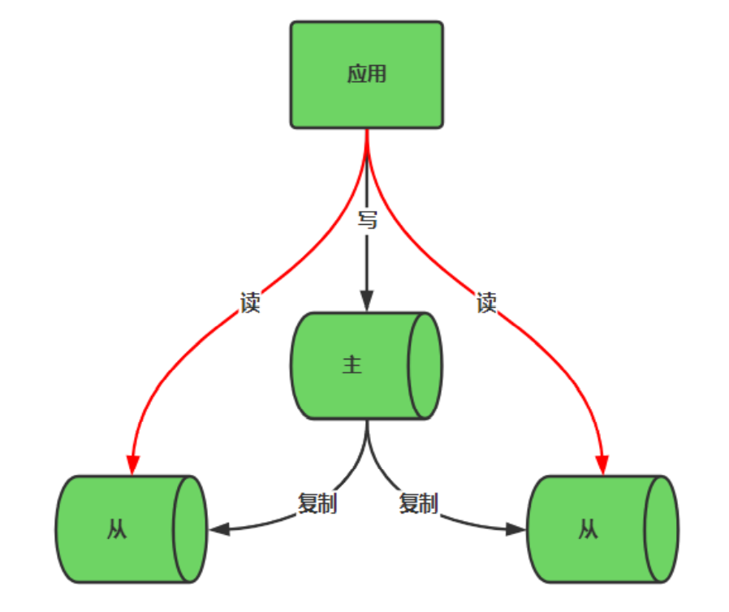

## String
```
    command line
    set key value
    get key value
    setnx key value                     //if key not exsit,write and return 1,else return 0
    flushdb                             //delete all data from this db
    select db                           //checkout db

    incr key                            //can only change number. And if key not exsit,create key and it`s value = 1
    decr key                            //like incr.And if key not exsit ,create key and it`s value = -1
    incrby key step                     //incr step for key. And ifkey not exsit,create key and it`s value = step
    decrby key step                     //decr step for key. And ifkey not exsit,create key and it`s value = step

    mset key1 value1 key2 value2 ...
    msetnx key1 value1 key2 value2 ... // Atomicity.原子性。
    

    getrange start end  //out of range return ''.If end = -1 return start to value end
    setrange start end  //

    setex key ttl       //set key expire ttl seconds later.
    ttl key             //get expire time
    getset key value    // set key for new value,and return old value if old is not expire,else return nil

    maxsize 512M
```
## List
Double Linked List
ziplist <-> ziplist <-> ziplist <-> ziplist       //construct a quicklist

```
    lpush\rpush key value1 [value2...]            //append to the list head or tail.
    lrange key start stop                         // stop = -1 ,get all data
    lpop key
    rpop key
    rpoplpush list1 list2                         //pop one of list1`s tail and insert to the list2`s head
    lindex key index                              // index = -1 last data 
    llen                                          //get list len
    linsert listName BEFORE|AFTER listvalue value //If listvalue not exist,return -1,If listName is not list,return error  
    lrem listname count value                     //delete count key from list. if count = 0,delete all from list where listvalue = value
    lset listname index value                     //replace list[index] by value.If index not exsit,return error.  
```

## Set
Hashtable

```
    sadd key value1 ....                //add a set with values
    smember key                         //return all member
    sismember key value                 //check value in set or not
    scard key                           //return count of set
    srem key value1 ...                 //remove one or more value in set
    spop key count                      //pop random values reforencen by count
    srandmember key count               //get random member from set reforence by count
    smove set1 set2 member              //move member of set1 to set2
    sinter set1 set2 ...                //get intersection of sets
    sinterstore aimset set1 set2 ...    //write interserction to aimset of set1 set2 ...
    sunion set1 set2 ...                //get union of set1 set2 ...
    sdiff set1 set2 ...                 //get diff of set1 set2 ...
    sdiffstore aimset set1 set2 ...     //write diff to aimset of set1 set 2 ...                                        
```

## Hash
`key` => `value`
```
    hset name key value                 //add key value for name
    hget name key                       //get key`s value
    hexists name key                    //check key exist or not
    hkeys name                          //get all keys
    hvals name                          //get all values
    hlen name                           //get len of hash
    hincrby name key incrNum            //if incrnum > 0, add incrnum < 0,decr. if key`s value is not a number,error.Not exist,create.
    hsextnx name key value              //if not key exist,creat.else do noting 
```

## zset (sorted set)
```
    zadd zname score name1 score name2...                   //add to zset unique name with score, score can repeat
    zrange zname start end [WITHSCORES]                     //get zname`s value from start to end,if WITHSCORES list their score
    zrevrange zname start end [WITHCORES]                   //get values by decr
    zrangebyscore zname mixscore maxscore [WITHSCORES]      //get values between min and max score 
    zrevranagebyscore zname mixscore max score [WITHSCORES] //reverse
    zinrcby zname increament member                         //if increament > 0, add increament < 0,decr. if key`s value is not a number,error.Not exist,create.
    zrem zname member1 member2 ...                          //remove.if member not exist, skip.
    zremrangebyrank zname start end                         //delete by rank.end = -1 means last one.
    zremrangebyscore zname minscore maxscore                //delete member bewteen min score and max score
    zcount zname minscore maxscore                          //count member between min score and max score
    zrank zname member                                      //return rank of the member,the first is zero.
    zrevrank zname member                                   //return reverse rank of the member,the end id zero.
    zscore zname member                                     //return the member`s  score
```
### zset and jumptable 
```
    according to score and create a jumptable, and index
```

## subscribe and publish
```
    subscribe channel1 channel2                             //subscribe one or more channel
    publish channame message                                //publish message to subscribe
    psubscribe pattern                                      //subscribe channels by pattern
```

## geo
```
    geoadd gname  longitude lantitude member ...              //add addresses
    geopos gname member1 member2 ...                          //get geo member`s address
    geodist gname member1 member2 [m|km|ft|mi]                //get distance of two members
    georedius gname longitude lantitude redius m|km|ft|mi     //use longitude and lantitude as point and redius as long,the round of element
```

## transaction

```
    MULTI
    ...                                                         //if hava a error command, `EXEC` retutrn (error) EXECABORT Transaction discard...
    EXEC|DISCARD                                                //exec or discard
```

```
    WATCH key1 ...
    MULTI
    ...
    EXCE     
    当对 key1 ...进行监听，如果在事务 `EXCE` 之前，被 `watch` 的 `key` 被修改了，那么事务直接执行失败。                                                   
```
#### 当事务EXEC 或者 DISCARD 之后，WATCH 就被取消了。
*需要注意的是：当事务中，有失败的，其他能成功执行的还是会成功执行，并不会像Mysql一样回滚，所以需要加锁。*


所以需要加锁

*悲观锁*

*乐观锁*


## Redis 事务的三大特征
```
    1. 单独隔离操作：事务会被序列化，在执行时不会被断
    2. 没有事务隔离：在提交之前，都不会执行，放在队列中。EXCE才执行
    3. 没有一致性：在组队阶段，如果指令错误，比如语法错误之类，会导致 EXCE 直接执行失败。在执行阶段，如果中间有指令执行失败，并不会影响其他操作，不能保证都成功或者都失败，也不会回滚。
```

## Redis持久化
### RDB(Redis Databases)
```
    1. 什么是RDB：指定时间间隔内将内存中的数据集持久化到磁盘， `Snopshot`也叫快照，恢复时将快照文件直接读取到内存中
    2. Redis fork一个子进程，先将数据写到内存中，持久化结束之后，替换上次的持久化文件。
    3. 可能会丢失在最后一次数据
    4· 持久化配置  save times options  //多少*times*内执行了多少次*options*，触发RBD
    5. 优势：适合大规模数据恢复、适合对数据完整性和一致性不高、节省磁盘空间、恢复速度快
    6. fork子进程进行复制时，会导致内存中数据变成原来的两倍、数据庞大时比较消耗性能、可能丢失最后一次数据
```
### AOF(Append Only File)
```
    1. 什么是AOF： 以日志的形式增量保存redis执行过程中的所有写指令。Redis启动时会读取该文件重构数据。
    2. 持久化流程：将客户端的写请求append到AOF缓冲区、根据持久化策略 [ always, erverysec ,no] Sync写入到磁盘文件、AOF文件超过重写策略或者手动重写，对文件重写，压缩容量。   
    3. AOF 和 RDB 同时存在时，默认读取AOF文件
    4. AOF默认关闭 appendOnly no
    5. AOF同步频率：appenfsync always|erverysec|no //每次写时操作，每秒同步，不自动同步
    6. 劣势：备份速度慢、体积大(因为每个写操作都要记录)
    7. AOF默认文件大小64M，太小了,可以改大
    8. I/O操作比较多
```


## 主从复制 
主机更新后根据配置和策略，同步到从机的 `master - slave` 机制，Master以写为主，Slave以读为主。读写分离性能高，容灾备份免挂掉。


## 分布式锁

```

```